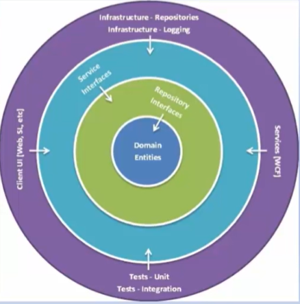

# Arquitetura Cebola (Onion Architecture)

O principal objetivo da Arquitetura Cebola é enfrentar os desafios encontrados na Arquiteturas em Camadas e fornecer uma solução para problemas comuns, como acoplamento e a separação das responsabilidades de forma mais clara.

A Arquitetura Cebola está baseada no *Princípio da Inversão de Controle* e é composta por várias camadas concêntricas que se interconectam em direção ao núcleo que representa o domínio. Ela não depende da *camada de dados* como nas arquiteturas em várias camadas, mas dos *modelos de domínio reais*.

A Onion Architecture resolveu o problema de acoplamento entre as camadas definindo camadas a partir do núcleo para a infraestrutura.

Ela aplica a *regra fundamental* movendo todos os acoplamentos em direção ao centro, sendo que no centro da Onion Architecture está o **modelo de domínio**, que representa os objetos de negócios e o comportamento.

Ao redor da camada de domínio existem outras camadas (UI, Infra, Repositories, Interfaces).

## Camadas

**Camada de domínio** (Domain Model): Representa os objetos de negócios e o comportamento, e pode conter interfaces de domínio. Esta camada não possui nenhuma dependência.

**Camada de serviços de domínio** (Domain Services): cria uma abstração entre as entidades do domínio e a lógica de negócios do aplicativo. Nesta camada, temos as interfaces que fornecem o comportamento de salvar e recuperar objetos, geralmente envolvendo um repositório que acessa a fonte de dados.

**Camada de serviços da Aplicação** (Application Services): mantém interfaces com oerações comuns, como Adicionar, Salvar, Editar e Excluir. Além disso, essa camada é usada para se comunicar com a camada da interface do usuário e a camada do repositório.

**Camadas externas (UI, Infrastructure, Tests)**: no anel mais externo temos os componentes que mudam com frequência: a camada de apresentação, o acesso aos dados e os testes.

## Vantagens
- As camadas da Onion Architecture são conectadas através de *interfaces*. As implementações são fornecidas durante o tempo de execução.
- A arquitetura do aplicativo é construída sobre um *modelo de domínio*.
- Toda dependência externa, como acesso ao banco de dados e chamadas de serviço, é representada em *camadas externas*.
- Não há nenhuma dependência da camada interna com camadas externas.
- Pode ser testada rapidamente porque o núcleo do aplicativo, o domínio, não depende de nada.
- Os acoplamentos estão voltados para o centro (regra de dependência).

## Desvantagens
- Não é fácil de entender para iniciantes.
- Tem uma curva de aprendizado.
- Pode ser difícil fazer a divisão das responsabilidades entre as camadas.
- Utiliza interfaces em profusão.

## Principais características
- O aplicativo é construído em torno de um modelo de objeto independente (o *domínio*).
- Camadas internas definem *interfaces*. As camadas externas *implementam* interfaces.
- A direção do acoplamento é em direção ao centro (Regra da dependência).
- Todo o código principal do aplicativo pode ser compilado e executado separadamente da infraestrutura.

## Referências

**Clean Architecture Essencial - ASP .NET Core com C#**, em [Udemy](https://www.udemy.com/course/clean-architecture-essencial-asp-net-core-com-c/).