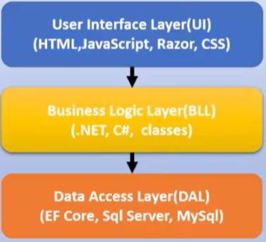

# Arquitetura em camadas (Layered Architecture)

A Arquitetura em camadas visa a criação de **aplicativos modulares**, de forma que cada camada possui uma **responsabilidade** e onde a camada superior se comunica com a camada inferior e assim por diante, fazendo com que uma camada seja *dependente* apenas da camada *imediatamente inferior*.

Podemos assim dividir um sistema em uma, duas, três ou n camadas dependento do objetivo e da complexidade do sistema.

Dependendo do contexto as camadas podem ser lógicas (**Layers**) ou físicas (**Tiers**).

Uma das mais conhecidas é a arquituetura em três camadas, onde temos:
1) camadas de interface (UI - User Interface Layer)
2) camada da lógica dos negócios (BLL - Business Logic Layer)
3) camada de acesso aos dados (DAL - Data Access Layer)

## Vantagens
- Com a organização do código em camadas podemos reutilizar a funcionalidade de baixo nível em todo o aplicativo.
- Com uma arquitetura em camadas, os aplicativos podem impor restrições sobre quais camadas podem se comunicar com outras camadas.
- Essa arquitetura ajudar a atingir o encapsulamento.
- Quando uma camada é alterada ou substituída, apenas as camadas que interagem com ela serão afetadas.
- As camadas (e o encapsulamento) tornam muito mais fácil substituir a funcionalidade dentro de um projeto.

## Desvantagens
- As dependências em tempo de compilação são executadas de cima para baixo.
- Assim a camada de negócios (BLL) depende dos detalhes de implementação da camada de acesso aos dados.
- Testar a lógica de negócio nesta arquitetura é difícil pois exige um banco de dados de teste.

Para resolver esse problema podemos usar a inversão de dependência em uma arquitetura mais robusta como a Arquitetura Cebola (Onion Architecture).

## Referências

**Clean Architecture Essencial - ASP .NET Core com C#**, em [Udemy](https://www.udemy.com/course/clean-architecture-essencial-asp-net-core-com-c/).