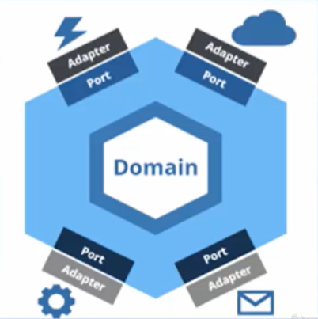

# Arquitetura Hexagonal

Arquitetura hexagonal ou *Portas* e *Adaptadores* possui os mesmos objetivos e princípios da Arquitetura Cebola:
- Separar as responsabilidades para criar uma aplicação Modular.
- Isolar o domínio no core do projeto.
- Favorecer o baixo acoplamento.
- Favorecer a testabilidade

Na Arquitetura Hexagonal não existem camadas. Temos o aplicativo, as portas e os adaptadores.

As portas pertencem ao aplicativo, são a API do aplicativo.

Os adaptadores estão fora do aplicativo e cada um depende de uma porta do aplicativo.

## Referências

**Clean Architecture Essencial - ASP .NET Core com C#**, em [Udemy](https://www.udemy.com/course/clean-architecture-essencial-asp-net-core-com-c/).
