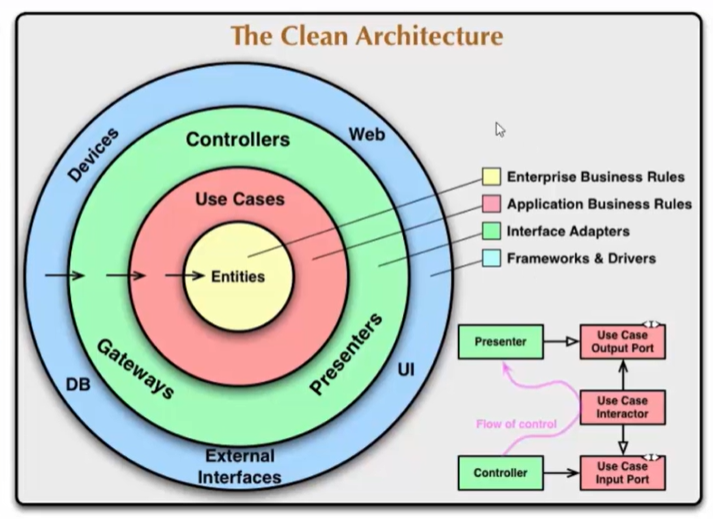

# Arquitetura Limpa (Clean Architecture)

## Arquitetura de Software
A Arquitetura de Software define o que é o sistema em termos de *componentes de software*, os *relacionamentos* entre estes componentes e os *padrões* que guiam a sua composição e restrições.

Assim, a arquitetura significa o **design geral do projeto**. É a *organização* do código em classes, arquivos, componentes ou módulos. E é como todos esses grupos de código se relacionam entre si.

A arquitetura de software expõe a estrutura de um sistema equanto oculta os detalhes de implementação.

## Clean Architecture
Arquitetura Limpa é um **conceito** proposto por Robert C. Martin (Uncle Bob) como uma forma de construir soluções de software *altamente flexíveis* e *sustentáveis*.

O conceito foi baseado nas boas práticas e nas arquiteturas hexagonal e cebola, dentre outras, que já propunham a separação das responsabilidades em camadas e tinham como objetivo produzir sistemas com as seguintes características:
- Independente de frameworks
- Testáveis
- Independentes da interface do usuário
- Independentes do banco de dados
- Independente de qualquer agente externo

Arquitetura Limpa refere-se à **organização do projeto** de forma que ele seja fácil de *entender*, fácil de *testar*, fácil de *manter* e fácil de *mudar* conforme o projeto cresce.

**Regra de Dependência**: a dependência do código-fonte só ponte apontar para o *interior do aplicativo*.

## Entities e Use Cases
No centro da arquitetura, temos as classes responsáveis pelas regras de negócio, que podem ser de dois tipos: Entidades e Casos de Uso.

### Entidade
É um conjunto de regras de negócios relacionadas que são críticas para o funcionamento do aplicativo. 

As regras seriam agrupadas como métodos em uma classe.

Como as entidades não conhecem as outras camadas, elas não dependem de nada.

## Referências

**Clean Architecture Essencial - ASP .NET Core com C#**, em [Udemy](https://www.udemy.com/course/clean-architecture-essencial-asp-net-core-com-c/).