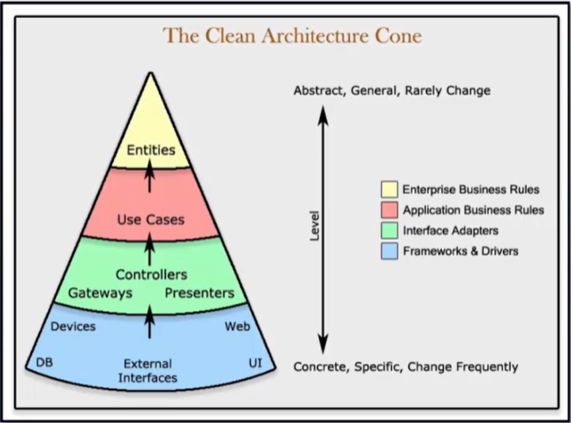

# Arquitetura Limpa (Clean Architecture)

## Arquitetura de Software
A Arquitetura de Software define o que é o sistema em termos de *componentes de software*, os *relacionamentos* entre estes componentes e os *padrões* que guiam a sua composição e restrições.

Assim, a arquitetura significa o **design geral do projeto**. É a *organização* do código em classes, arquivos, componentes ou módulos. E é como todos esses grupos de código se relacionam entre si.

A arquitetura de software expõe a estrutura de um sistema equanto oculta os detalhes de implementação.

## Clean Architecture
Arquitetura Limpa é um **conceito** proposto por Robert C. Martin (Uncle Bob) como uma forma de construir soluções de software *altamente flexíveis* e *sustentáveis*.

O conceito foi baseado nas boas práticas e nas arquiteturas hexagonal e cebola, dentre outras, que já propunham a separação das responsabilidades em camadas e tinham como objetivo produzir sistemas com as seguintes características:
- Independente de frameworks
- Testáveis
- Independentes da interface do usuário
- Independentes do banco de dados
- Independente de qualquer agente externo

Arquitetura Limpa refere-se à **organização do projeto** de forma que ele seja fácil de *entender*, fácil de *testar*, fácil de *manter* e fácil de *mudar* conforme o projeto cresce.

**Regra de Dependência**: a dependência do código-fonte só ponte apontar para o *interior do aplicativo*.

## Entities e Use Cases
No centro da arquitetura, temos as classes responsáveis pelas regras de negócio, que podem ser de dois tipos: Entidades e Casos de Uso.

### Entidade
É um conjunto de regras de negócios relacionadas que são críticas para o funcionamento do aplicativo. 

As regras seriam agrupadas como métodos em uma classe.

Como as entidades não conhecem as outras camadas, elas não dependem de nada.

### Casos de Uso
Contém as regras de negócio específicas do aplicativo.

Dizem como automatizar o sistema determinando o seu comportamento.
- Orquestram o fluxo de dados de e para as entidades
- Diorecionam as entidades a usar suas regras de negócio

Exemplo:
- Obter informações de um produto: nome, preço, quantidade, etc
- Montar catálogo de produtos
- Validar nome, preço, estoque
- Verificar estoque
- Se houver estoque incluir o produto no catálogo

Os casos de uso interagem e dependem das entidades, mas não sabem nada sobre as camadas mais distantes.

### Adaptadores
Na terceira camada, a partir do centro, temos classes e interfaces chamadas de Adaptadores.

A função delas é converter dados de um formato para outro.

São os tradotures entre o **domínio** e a **infraestrutura**.

Convertem os dados do formato mais conveniente para os **casos de uso e entidades**.

É essa camada que vai conter a implementação MVC de uma UI com apresentadores, visualizações e controladores, ou, que poderá realizar a implementação dos endpoints de uma API REST (recebe as requisições e encaminha para os Casos de Uso)

Nenhum código dentro desse círculo deve saber absolutamente nada sobre o banco de dados.

### Camada mais externa

Essa camada é para onde vão todos os componentes de entrada e saída ou I/O, a interface com o usuário - IU, o banco de dados, os frameworks, os dispositivos, etc.

Esta camada é para onde vão todos os detalhes. A interface é um detalhe. O banco de dados é um detalhe. É a camada mais volátil pois onde pode mudar com frequência.

Essa camada é mantida o mais longe possível das camadas de domínio.

Como elas são mantidos separadas, é fácil fazer alterações ou trocar um componente por outro, por exemplo: IU, banco de dados, estruturas, dispositivos.

### The Clean Architecture Cone

As **camadas internas** são mais estáveis.

As **camadas externas** são mais sujeitas a mudanças.

As **entidades** raramente devem ser modificadas.

Alterações nos **Use Cases** não devem ser motivadas por mudanças na tecnologia, banco de dados, frameworks, etc.

## Referências

**Clean Architecture Essencial - ASP .NET Core com C#**, em [Udemy](https://www.udemy.com/course/clean-architecture-essencial-asp-net-core-com-c/).