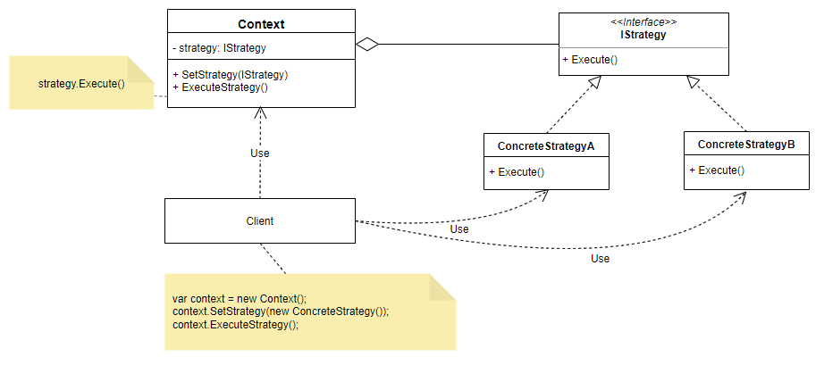

# Strategy Pattern

## Definição:
> Definir uma família de algoritmos, encapsular cada uma delas e torná-las intercambiáveis. Strategy permite que o algoritmo varie independentemente dos clientes que o utilizam. (GOF)

## Problemas que ataca
- Como uma classe pode utilizar um algoritmo definido dinamicamente?
- Como posso selecionar e trocar uma lógica em tempo de execução?

## Solução
- Encapsular os algoritmos possíveis para o mesmo problema em uma estrutura de Strategy
- O cliente irá delegar a execução para estas estratégias ao invés de possuir toda a lógica internamente.

## Exemplo 

~~~
public interface IStrategy
{
    void Execute();
}
~~~

**Strategy**: declara uma interface comum a todos os algoritmos suportados. Context usa esta interface para chamar o algoritmo definido por uma ConcreteStrategy.

~~~
public class ConcreteStrategyA : IStrategy
{
    public void Execute()
    {
        Console.WriteLine("Executing strategy A");
    }
}

public class ConcreteStrategyB : IStrategy
{
    public void Execute()
    {
        Console.WriteLine("Executing strategy B");
    }
}
~~~

**ConcreteStrategy**: implementa o algoritmo usando a interface Strategy.

~~~
public class Context
{
    private IStrategy? _strategy;

    public void SetStrategy(IStrategy strategy)
    {
        _strategy = strategy;
    }

    public void ExecuteStrategy()
    {
        _strategy?.Execute();
    }
}
~~~

**Context**: é configurado com um objeto ConcreteStrategy. Mantém uma referência a um objeto Strategy. Pode definir uma interface que permite ao Strategy acessar seus dados.

## Exemplo Concreto

~~~

/// 

/// The 'Strategy' interface
/// 

public interface ISortStrategy
{
    public void Sort(List<string> list);
}

/// 

/// A 'ConcreteStrategy' class
/// 

public class QuickSort : ISortStrategy
{
    public override void Sort(List<string> list)
    {
        list.Sort();  // Default is Quicksort
        Console.WriteLine("QuickSorted list ");
    }
}

/// 

/// A 'ConcreteStrategy' class
/// 

public class ShellSort : ISortStrategy
{
    public override void Sort(List<string> list)
    {
        //list.ShellSort();  not-implemented
        Console.WriteLine("ShellSorted list ");
    }
}

/// 

/// A 'ConcreteStrategy' class
/// 

public class MergeSort : SortStrategy
{
    public override void Sort(List<string> list)
    {
        //list.MergeSort(); not-implemented
        Console.WriteLine("MergeSorted list ");
    }
}

/// 

/// The 'Context' class
/// 

public class SortedList
{
    private List<string> list = new List<string>();
    private SortStrategy sortstrategy;

    public void SetSortStrategy(SortStrategy sortstrategy)
    {
        this.sortstrategy = sortstrategy;
    }

    public void Add(string name)
    {
        list.Add(name);
    }

    public void Sort()
    {
        sortstrategy.Sort(list);
        // Iterate over list and display results
        foreach (string name in list)
        {
            Console.WriteLine(" " + name);
        }
        Console.WriteLine();
    }
}
~~~

## Referências
**Strategy**, em [Refactoring Guru](https://refactoring.guru/pt-br/design-patterns/strategy). Acesso em: 22/01/2024.

**Strategy in C#**, em [Refactoring Guru](https://refactoring.guru/design-patterns/strategy/csharp/example). Acesso em: 22/01/2024.

**C# Strategy Design Pattern**, em [DOFACTORY](https://www.dofactory.com/net/strategy-design-pattern). Acesso em: 20/01/2024.

**Design Pattern - Strategy**, em [DEV Community](https://dev.to/marcosbelorio/design-pattern-strategy-111n). Acesso em: 20/01/2024.

**C# Strategy Pattern**, em [CSHARP Tutorial](https://www.csharptutorial.net/csharp-design-patterns/csharp-strategy-pattern/). Acesso em: 22/01/2024.

**Padrões de Projeto em JAVA na Prática!**, por Cod3r Cursos, em [Udemy](https://www.udemy.com/course/padroes-de-projeto-em-java-na-pratica/).

