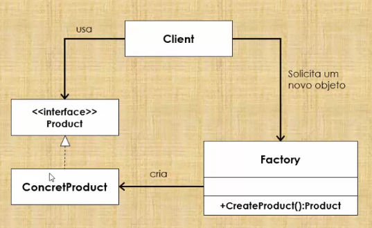
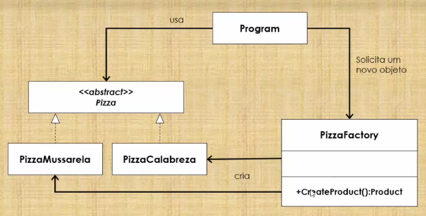

# Simple Factory

1. Cria objetos sem expor a lógica de instanciação ao cliente.
2. Refere-se ao objeto recém criado por meio de uma interface comum.

1. O cliente precisa de um produto, mas ao invés de criá-lo diretamente usando o operador **new**, pede ao objeto **Factory** (fábrica) um novo produto, fornecendo as informações sobre o tipo de objeto de que necessita.

2. A *fábrica* instancia um **novo produto** concreto e, em seguida, retorna ao cliente o produto recém criado (convertido para uma classe de produto abstrata)

3. O **cliente** usa os produtos como produtos abstratos sem estar ciente de sua implementação concreta.

## Exemplo de uso do padrão Factory

## Benefícios

* Fornece ao cliente um mecanismo simples para criar objetos.
* Centraliza a lógica de criação de objetos.
* O cliente não precisará ser alterado na criação de novos produtos.
* As classes não sabem quais subclasses exatas devem ser criadas (*desacoplamento*).
